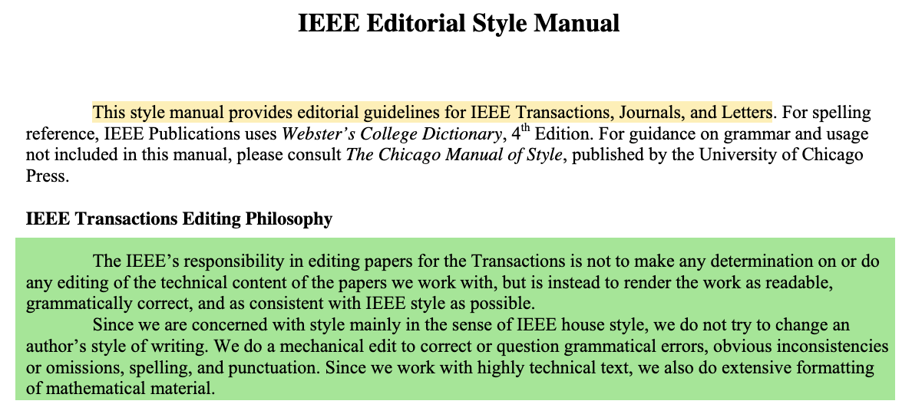

- You can annotate any PDF files you have [attached]([[files]]) to your Logseq blocks.
- **USAGE**
	- Drag & drop a PDF file into Logseq or attach it (see [[Files]])
	- You can highlight 
	  1. specific text, or
	  1. an area in the document (such as an image) via the area highlight toolbar button (then drag your pointer) - click the icon in the toolbar or hold `Cmd` or `Alt`
		- When highlighting text you can either
		  1. mark the text with a color to copy a reference to the text which can be pasted into the Logseq editor
		  1. copy the text
		  1. copy a reference to the text to be pasted into the Logseq editor
	- You can also display an outline of the PDF.
	-
	  #+BEGIN_NOTE
	  Annotations will be stored in an `.edn` file with the same name as your PDF file. References will be stored in a Markdown file (`hls__<name>.md`) with the same name as your PDF file.
	  #+END_NOTE
	-
	  #+BEGIN_TIP
	  `Shift-click` a reference to open it in your sidebar (it is simply another Markdown file). You can change its formatting there which will be taken over by any block references.
	  #+END_TIP
	-
	  #+BEGIN_CAUTION
	  **Renaming PDF files**
	  When you rename your file, the corresponding metadata file that stores your highlights is not going to be renamed. You need to do this yourself to prevent broken annotations.
	  #+END_CAUTION
- **EXAMPLES**
	-  (click the link!)
		- Reference a block
			- ((610fb9ae-e65d-44c8-a6a3-03e6bffcd86a))
			  `((610fb9ae-e65d-44c8-a6a3-03e6bffcd86a))`
		- Embed a block (obviously, you cannot edit it, but it allows you to see the number of references)
			- {{embed ((610fb9ae-e65d-44c8-a6a3-03e6bffcd86a))}}
			  `{{embed ((610fb9ae-e65d-44c8-a6a3-03e6bffcd86a))}}`
		- Reference an area
			- ((610fba3e-bc73-458c-83b0-9a4259a5f322))
			- The resulting PDF with highlights:
				- 